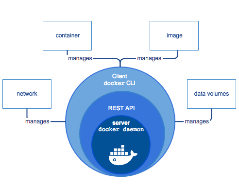
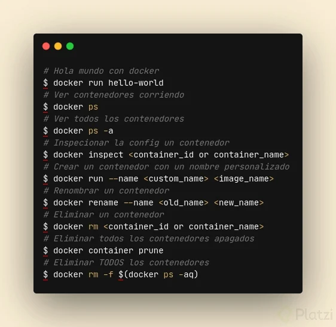
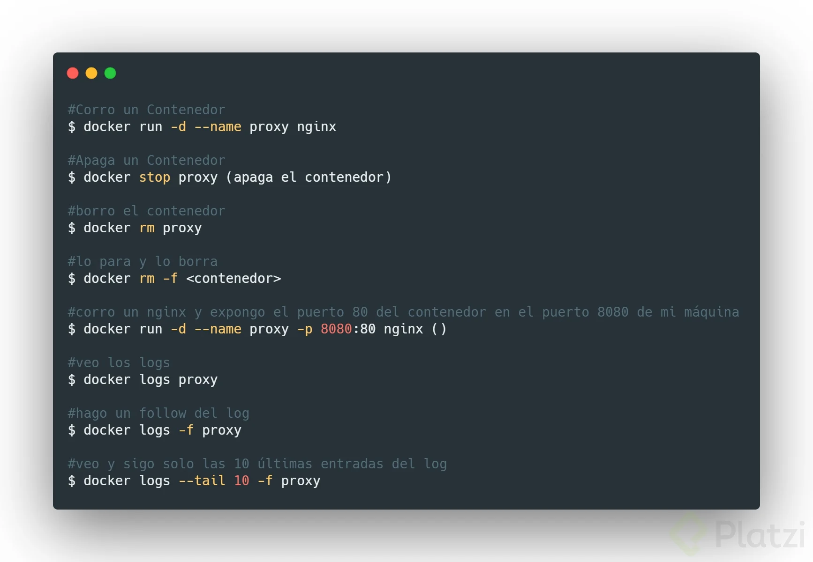
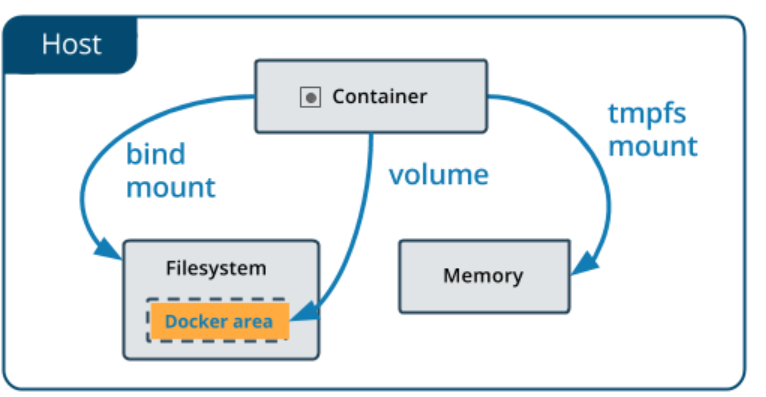
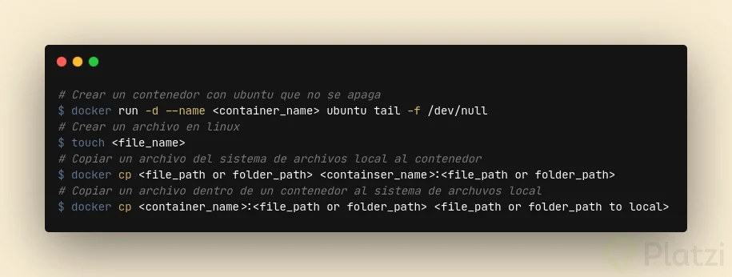

# Docker curso basico platzi

## Generalidades



Componentes dentro del circulo de Docker:

**Docker Daemon:** Es el centro de docker, el corazón que gracias a el, podemos comunicarnos con los servicios de docker.

**REST API:** Como cualquier otra API, es la que nos permite visualizar docker de forma "gráfica".

**Cliente de Docker:** Gracias a este componente, podemos comunicarnos con el corazón de docker (Docker Daemon) que por defecto es la línea de comandos (docker CLI).

Dentro de la arquitectura de Docker encontramos:

**Contenedores:** Es la razón de ser de Docker, es donde podemos encapsular nuestras imagenes para llevarlas a otro PC, o servidor, etc.

**Imagenes:** Son las encapsulaciones de x contenedor. Podemos correr nuestra aplicación en Java por medio de una imagen, podemos utilizar Ubuntu para correr nuestro proyecto, etc.

Para crear una imagen a partir de un dockerfile, estando parados en la carpeta que contiene el archivo, ejecutamos el comando: 
```bash
docker build -t nombre_de_tu_imagen .
```
**Volumenes de datos:** Podemos acceder con seguridad al sistema de archivos de nuestra máquina.

**Redes:** Son las que permiten la comunicación entre contenedores.

Cheat Sheet Comandos: https://collectednotes.com/barckcode/docker-cheat-sheet

---
## Contenedores

Es una agrupación de procesos.

Es una entidad lógica, no tiene el limite estricto de las máquinas virtuales, emulación del sistema operativo simulado por otra más abajo.

Ejecuta sus procesos de forma nativa.

Los procesos que se ejecutan adentro de los contenedores ven su universo como el contenedor lo define, no pueden ver mas allá del contenedor, a pesar de estar corriendo en una maquina más grande.

No tienen forma de consumir más recursos que los que se les permite. Si esta restringido en memoria ram por ejemplo, es la única que pueden usar.

A fines prácticos los podemos imaginar cómo maquinas virtuales, pero NO lo son. Máquinas virtuales livianas.

Docker corre de forma nativa solo en Linux.

Sector del disco: Cuando un contenedor es ejecutado, el daemon de docker le dice, a partir de acá para arriba este disco es tuyo, pero no puedes subir mas arriba.

Docker hace que los procesos adentro de un contenedor este aislados del resto del sistema, no le permite ver más allá.

Cada contenedor tiene un ID único, también tiene un nombre.

## Comandos basicos docker




---
## Datos en docker



**Bind Mount:** Guarda los archivos en la maquina local persistiendo y visualizando estos datos (No seguro).

```Docker
docker run -v ruta_del_directorio_local:ruta_en_el_contenedor imagen_del_contenedor
```

**Volumenes:** Guarda los archivos en el area de Docker donde Docker los administra (Seguro).

```Docker
docker volume create nombre_del_volumen
docker run --mount source=nombre_del_volumen,target=ruta_en_el_contenedor imagen_del_contenedor
```

**TMPFS Mount:** Guarda los archivos temporalmente (Memoria RAM) y persiste los datos en la memoria del contenedor, cuando muera sus datos mueren con el contenedor. Solo disponible cuando se corre docker en linux.

Es posible copiar archivos del HOST al contenedor o viceversa, estos serían los comandos:


